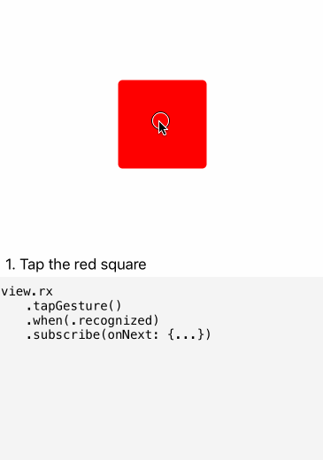

# RxGesture

[](http://cocoapods.org/pods/RxGesture)
[](http://cocoapods.org/pods/RxGesture)
[](http://cocoapods.org/pods/RxGesture)

## Usage



To run the example project, clone the repo, in the __Example__ folder open `RxGesture.xcworkspace`.

You _might_ need to run `pod install` from the Example directory first.

**NB**: Currently this library uses the latest beta of RxSwift 3.0.0 so it's a pre-release software.

---

__RxGesture__ allows you to easily turn any view into a tappable or swipeable control like so:

```ruby
myView.rx.gesture(.tap).subscribe(onNext: {_ in
   //react to taps
}).addDisposableTo(stepBag)
```

You can also react to more than one type of gesture. For example to dismiss a photo preview you might want to do that when the user taps it, or swipes up or down:

```ruby
myView.rx.gesture(.tap, .swipeUp, .swipeDown).subscribe(onNext: {_ in
   //dismiss presented photo
}).addDisposableTo(stepBag)
```

`rx_gesture` is defined as `Observable<RxGestureTypeOption>` so what it emits is the concrete type of the gesture that was triggered (handy if you are observing more than one type)

On __iOS__ RXGesture supports:

 - .tap
 - .tapNumberOfTimes(Int)
 - .swipeLeft, .swipeRight, .swipeUp, .swipeDown
 - .longPress
 - .pan(.began), .pan(.changed), .pan(.ended), .pan(.any)
 - .rotate(.began), .rotate(.changed), .rotate(.ended), .rotate(.any)

On __OSX__ RXGesture supports:

 - .Click
 - .RightClick
 - .pan(.began), .pan(.changed), .pan(.ended), .pan(.any) (if used in one call to `rx.gesture` until `NSGestureRecognizer` implements `rx.event`)
 - .rotate(.began), .rotate(.changed), .rotate(.ended), .rotate(.any) (if used in one call to `rx.gesture` until `NSGestureRecognizer` implements `rx_event`)

If you are writing multi-platform code you can eventually write:

```swift
myView.rx.gesture(.tap, .click).subscribe(...)
```

to observe for the concrete gesture on each platform.

## Continuous gestures

Some recognizers fire a single event per gesture and don't provide any values. For example `.Tap` just lets you know a view has been tapped - that's all.

Other recognizers provide details about the gesture (that also might be ongoing). For example the pan gesture will continuously provide you with the offset from the initial point where the gesture started:

```swift
myView.rx.gesture(.pan(.changed)).subscribe(onNext: {[weak self] gesture in
    switch gesture {
    case .pan(let data):
	    print("offset: \(data.translation)")
    default: break
    }
}).addDisposableTo(bag)
```

Pattern match the associated value of type `PanConfig` to get the translation, velocity, and a ref to the recognizer itself.

__The demo app includes examples for all recognizers__.

## Requirements

This library depends on both __RxSwift__ and __RxCocoa__.

## Installation

RxGesture is available through [CocoaPods](http://cocoapods.org). To install
it, simply add the following line to your Podfile:

```ruby
pod "RxGesture"
```

## TODO

- can use help about adding tests - UI tests aren't my strongest side
- make pr to rxcocoa to add native support for rx.event to `NSGestureRecognizer` and remove the implementation from this repo

## Thanks

Everyone in the RxSwift Slack channel 💯

## License

RxGesture is available under the MIT license. See the LICENSE file for more info.
